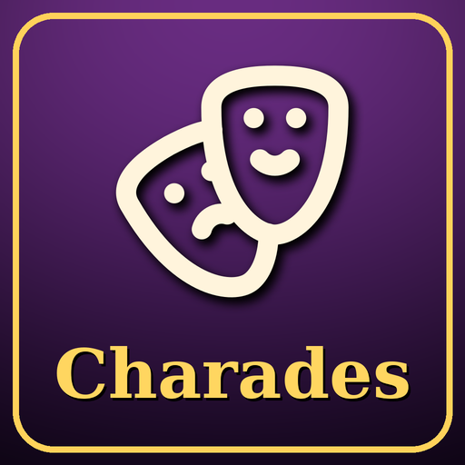

# Charades

Emotes, commands and roleplay text at your fingertips: a searchable menu, a radial wheel and key bindings.

## Features

- **Menu** with favorites (gold) and collapsible categories. Resizable, scrollable, with search.
- **All emotes view**: every emote the game knows, with an *Animated only* filter. Left-click to use, right-click to add to favorites.
- **Radial wheel**: hold the wheel key, point at an item, release. Categories sit on the inner ring, Favorites open by default right under the cursor. Optional click-to-confirm (release the key to cancel) and right-click to cancel.
- **Actions are flexible**:
  - `/dance` plays an emote with its animation
  - `/anycommand` runs any slash command, including other addons' commands
  - `/e waves happily` sends a custom text emote (`/s` and `/y` work too)
  - `Hello there!` (no slash) is said aloud
  - `/bow; /wait 1; Well met!` runs a sequence
- **55 animated emotes built in**, sorted into Social, Moods, Rest, Reactions and Signals.
- **Icons** for everything: 175 bundled icons made for emotes and roleplay, plus the classic game icons, all searchable.
- **In-game editor** (Options > AddOns > Charades): add, edit and drag items and categories, favorites, restore defaults.
- **Profiles**: shared across the account or separate per character. Export and import as readable JSON.
- **Key bindings** for the menu, the wheel and favorites 1 to 10, set right in the addon's options.

## Usage

- Left-click the minimap button for a quick menu: open Charades, settings, your favorites (listed directly) and your categories as submenus. Click an item to use it.
- Right-click the minimap button, use the Addon Compartment, or type `/charades` to open the Charades window.
- `/charades help` lists all commands.

## Limitations

- Protected Blizzard commands (`/cast`, `/use`, `/target`) cannot be run by addons.
- Outside instances the game may block chat text that is not sent directly by a click or key press, so text in later steps of a sequence can be dropped. Emotes are not affected.

## Credits

Icons in the `Icons` folder are drawn from [Lucide](https://lucide.dev) (ISC License).
